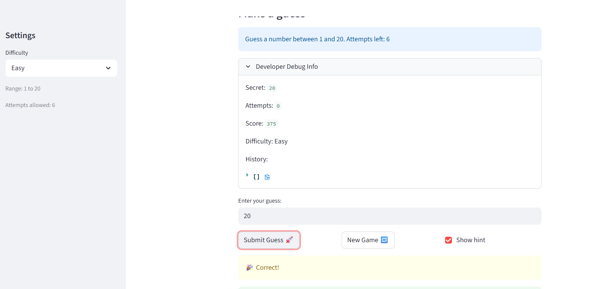

# 🎮 Game Glitch Investigator: The Impossible Guesser

## 🚨 The Situation

You asked an AI to build a simple "Number Guessing Game" using Streamlit.
It wrote the code, ran away, and now the game is unplayable. 

- You can't win.
- The hints lie to you.
- The secret number seems to have commitment issues.

## 🛠️ Setup

1. Install dependencies: `pip install -r requirements.txt`
2. Run the broken app: `python -m streamlit run app.py`

## 🕵️‍♂️ Your Mission

1. **Play the game.** Open the "Developer Debug Info" tab in the app to see the secret number. Try to win.
2. **Find the State Bug.** Why does the secret number change every time you click "Submit"? Ask ChatGPT: *"How do I keep a variable from resetting in Streamlit when I click a button?"*
3. **Fix the Logic.** The hints ("Higher/Lower") are wrong. Fix them.
4. **Refactor & Test.** - Move the logic into `logic_utils.py`.
   - Run `pytest` in your terminal.
   - Keep fixing until all tests pass!

## 📝 Document Your Experience

- [ ] Describe the game's purpose.
      It's a number guessing game where you guess the secret number that is generated between 1 and 100 (normal), 1 and 20 (easy), 1 and 50(hard). When the guess is wrong, a hint is given on whether to go higher or lower. You win when you guess the secret number and are given points for it
- [ ] Detail which bugs you found
      - The Higher/Lower hints were backwards — guessing too low told you to go lower
      - The secret number changed on every button click instead of staying fixed
      - The New Game button did not reset the game status, so the game stayed locked after a win or loss
      - Out-of-range guesses were accepted
      - The hint message always showed "1 to 100" regardless of difficulty
       - The logic functions were defined in both `app.py` and `logic_utils.py`, causing the import from `logic_utils` to be overridden

- [ ] Explain what fixes you applied. 
      - Corrected the hint logic in `check_guess` so Higher/Lower directions are accurate
      - Wrapped secret number generation in `if "secret" not in st.session_state` so it only runs once
      - Added `st.session_state.status = "playing"` and `history = []` to the New Game reset block
      - Added range validation to reject out-of-range guesses
      - Changed the hint message to use `{low}` and `{high}` variables
      - Removed the duplicate function definitions from `app.py` and moved all logic into `logic_utils.py`
      - Added `conftest.py` so pytest can find `logic_utils` from the `tests/` folder
      - Updated tests to check `result[0]` since `check_guess` returns a tuple

## 📸 Demo

- [ ] [Insert a screenshot of your fixed, winning game here]

## 🚀 Stretch Features

- [ ] [If you choose to complete Challenge 4, insert a screenshot of your Enhanced Game UI here]
